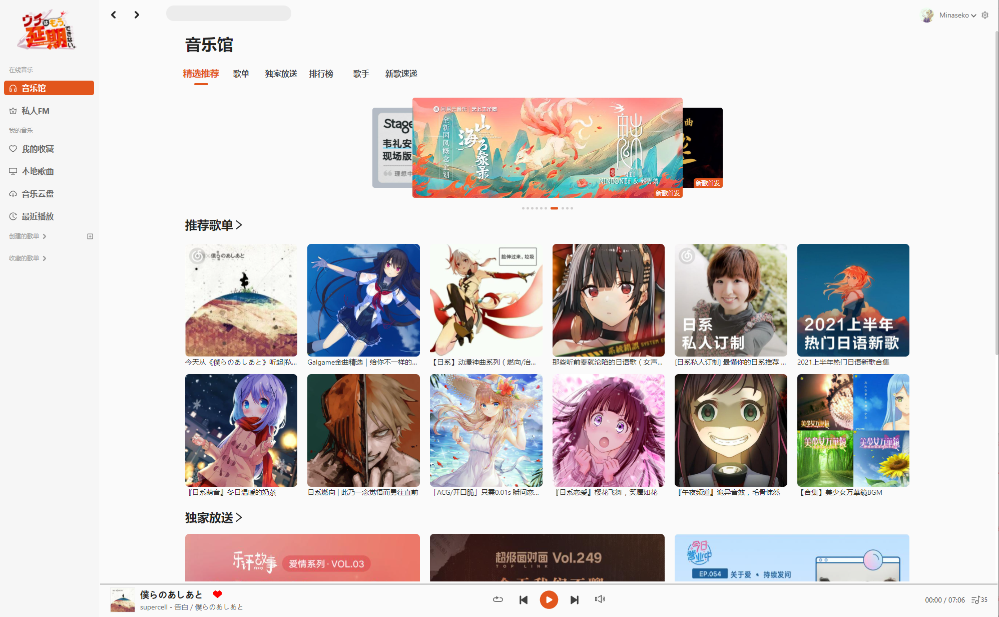

# Enki Music
基于 Vue3 的桌面 Web 端第三方网易云音乐播放器

API 使用 [Binaryify/NeteaseCloudMusicApi](https://github.com/Binaryify/NeteaseCloudMusicApi)

部署于 Vercel 的预览版本 [Enki Music](https://enki-music.naseko.com)

## 预览


## 特性
- Vue3 + Vite + Typescript + Antd 开发
- 网易云账号登录（扫码/手机/邮箱登录）
- 支持 MV 播放
- 支持歌词显示（有bug）
- 
## 安装
```shell
$ git clone https://github.com/nazeco/enki-music.git

$ npm install
```

## 运行
```shell
$ npm run dev     # 开发环境运行

$ npm run build   # 部署生产环境资源

$ npm run serve   # 生产环境运行
```